# lemmaly — Algorithm-First Proof

The model already knows Big-O, hash tables, divide-and-conquer, dynamic programming, sorting, graph algorithms, and amortized analysis. It just does not apply them spontaneously. lemmaly fixes the behavior, not the knowledge.

This skill is the gateway. It enforces the hard rules that every other guard in the suite assumes.

**Violating the letter of these rules is violating the spirit of the skill.** "Just this once" is how O(n²) ships to production.

## How to use — pick the right skill

The suite has four skills. Use this table to route to the right one. When in doubt, **start at lemmaly** — it is the gateway and will tell you when to escalate.

| If you are about to… | Use | Why |
| --- | --- | --- |
| Write *new* code that loops, queries, joins, recurses, or processes a collection | **lemmaly** | Forces complexity + data structure + algorithm family **before** code is written. |
| Refactor *existing* code that is already slow, OOMs, times out, or has nested loops / N+1 / repeated work | **complexity-cuts** | Corrective playbook for code that already shipped with bad Big-O. |
| Implement an algorithm where the obvious version is subtly wrong (binary search variants, in-place dedup, Boyer–Moore, QuickSelect partition, recursion with accumulators, fixed-point / termination concerns) | **invariant-guard** | Forces writing the function contract + loop invariant before code. The trap is in the contract, not the loop body. |
| Work with n ≥ 10⁶, similarity search, dedup at scale, top-K, streaming analytics, cardinality estimation, embeddings, FFT/NTT, dimensionality reduction, computational geometry, randomized algorithms | **mathguard** | Classical algorithms have hit their lower bound; an approximate or math-heavy technique (Bloom, HLL, Count-Min, MinHash/LSH, FFT, JL projection, sweep line, kd-tree) gives the asymptotic win. |
| Audit a codebase / PR for known anti-patterns (await-in-loop, .includes inside .filter, string-concat in loop, SELECT *, N+1, etc.) | **lemmaly** + `lemmaly scan` | The rule catalog plus the CLI scanner catches the 60 documented patterns across 11 languages. |

### Routing flow

```text
Are you writing new code?
├── yes → lemmaly (state complexity, structure, family BEFORE coding)
│         ├── classical algorithm at its lower bound AND n is large? → mathguard
│         └── subtle correctness trap (invariant, base case, off-by-one)? → invariant-guard
└── no, refactoring existing slow / OOM / timed-out code → complexity-cuts
          └── still slow after classical fixes? → mathguard
```

### One-line mental model

- **lemmaly** = think first (prevention).
- **complexity-cuts** = clean up bad Big-O (correction).
- **invariant-guard** = prove it's correct (verification).
- **mathguard** = beat the classical floor (acceleration).

## The Iron Law

```text
NO NON-TRIVIAL CODE WITHOUT STATED COMPLEXITY, DATA STRUCTURE, AND ALGORITHM FAMILY
```

Before you write a loop, a recursion, a query, or any computation over more than a handful of items, three things must appear in your message — in this order:

1. `time = O(?)`, `space = O(?)`, with the dominant input dimension named.
2. The data structure you will use, with a one-phrase reason.
3. The algorithm family (one of: linear scan, two-pointer, sliding window, binary search, sort+sweep, hash join, BFS/DFS, topo sort, Dijkstra/A*, union-find, DP, greedy, recursion+memo, prefix sum, segment tree, monoid reduction).

If you cannot state all three, you do not understand the problem yet. Ask, or read more code. Do not write code.

## Non-negotiable rules

1. **State complexity before writing any non-trivial code.** In one line:
   - `time = O(?)`, `space = O(?)`
   - Dominant input dimension: `n = what`, with realistic magnitude (e.g. `n ~ 10^6 rows`)
   - If you cannot state these, you do not yet understand the problem. Ask, or read more code.

2. **Name the data structure with a one-phrase reason.** Every collection-shaped value gets a deliberate choice from `Array / List / Set / HashMap / TreeMap / Heap / Deque / Trie / Graph / BitSet / Counter / LinkedList` — with the reason: "Set for O(1) membership inside the loop", "Heap for top-K in O(n log k)", "Counter to fold the nested loop into a single pass". Default to hashed structures (`Set`, `Map`) for lookup inside loops. Default to streaming/iterator over materialized list when n is large.

3. **Identify the algorithm family before writing.** Name one of: `linear scan`, `divide and conquer`, `two-pointer`, `sliding window`, `binary search`, `sort + sweep`, `hash join`, `BFS/DFS`, `topological sort`, `Dijkstra/A*`, `union-find`, `dynamic programming`, `greedy`, `recursion + memoization`, `prefix sum`, `segment tree`, `monoid reduction`. If you cannot name a family, you are about to write brute force. Stop and reconsider.

4. **Repeated work in loops is algorithmic waste.** All of these are presumed wrong until justified:
   - I/O inside a loop (database queries, HTTP calls, file reads) — batch with `IN (...)`, `Promise.all`, bulk endpoints, streaming
   - Recomputing the same value in a loop — hoist or memoize
   - Re-sorting / re-grouping inside a loop — sort once outside
   - Linear scan (`.find`, `.indexOf`, `.includes`, `in list`) inside a loop — precompute an index `Map`
   - Allocating fresh structures per iteration when one can be reused — hoist allocation
   - Materializing intermediate collections only to iterate again — fuse into one pass

   If you must do any of these inside a loop, write one comment line explaining why.

5. **No invented complexity or numbers.** Never write "O(log n) on average" without an argument. Never write "10x faster" or "~3ms" without measuring. If you cannot derive the complexity, write `<complexity: TBD>`. If you have not measured, write `<measured: TBD>`. Move on.

## The flow

```dot
digraph lemmaly_flow {
    rankdir=LR;
    start [label="About to write\ncode over a collection?", shape=diamond];
    state [label="State: time, space,\nn, structure, family", shape=box, style=filled, fillcolor="#fff3cd"];
    derived [label="Can derive all 5?", shape=diamond];
    ask [label="Stop. Ask, or\nread more code.", shape=box, style=filled, fillcolor="#f8d7da"];
    repeated [label="Loop body has I/O,\n.find, sort, await?", shape=diamond];
    justify [label="Write one-line\njustification", shape=box, style=filled, fillcolor="#fff3cd"];
    code [label="Write code\nmatching claims", shape=box, style=filled, fillcolor="#d4edda"];
    check [label="Verification\nchecklist passes?", shape=diamond];
    escalate [label="Escalate:\ncomplexity-cuts /\ninvariant-guard /\nmathguard", shape=box, style=filled, fillcolor="#cfe2ff"];
    done [label="Ship", shape=ellipse];

    start -> state [label="yes"];
    start -> done [label="trivial / n<10"];
    state -> derived;
    derived -> ask [label="no"];
    derived -> repeated [label="yes"];
    repeated -> justify [label="yes"];
    repeated -> code [label="no"];
    justify -> code;
    code -> check;
    check -> done [label="yes"];
    check -> escalate [label="no"];
    escalate -> state;
}
```



## The pre-write protocol

Before producing non-trivial code, your message must contain — in this order:

1. **Problem shape** — one sentence. ("Given n events with a timestamp, find the longest contiguous window where total weight ≤ K.")
2. **Input dimensions** — `n = ?`, realistic magnitude, whether hot path.
3. **Target complexity** — `time = O(?)`, `space = O(?)`.
4. **Data structures** — name them with a phrase each.
5. **Algorithm family** — one phrase.
6. **Edge cases you will handle** — empty, singleton, all-equal, n=1, n=max, overflow, duplicates. List the ones that apply.
7. **The code.**

If any of 1–6 is missing, do not emit code yet.

## When to load references

Load only the file you need. Do not bulk-load.

- `references/complexity.md` — choosing between O(1) / O(log n) / O(n) / O(n log n) / O(n^2) data structures and algorithms, with the practical n-thresholds where each starts to hurt.
- `references/n-plus-one.md` — ORM query loops (Prisma, Drizzle, SQLAlchemy, Django, ActiveRecord), `IN`/`join`/`select_related` fixes, batching patterns.
- `references/memory.md` — closures retaining DOM/state, unbounded caches, event-listener leaks, large-object retention, streaming over buffering.
- `references/async.md` — `Promise.all` vs sequential, concurrency limits, request coalescing, debouncing vs throttling, AbortController.
- `references/hot-paths.md` — recognizing hot paths (render functions, request handlers, inner loops, event listeners) and the kinds of work that do not belong in them.

## Rule catalog

The same anti-patterns the CLI scanner catches have one MD per rule under `rules/<rule-id>.md`. Load the specific rule when the pattern appears in code under review. Each rule file contains the why, the Incorrect example, the Correct example, and the sibling skill to escalate to.

**Languages covered (60 rules across 11 languages):** JavaScript / TypeScript, Python, SQL, Java, C#, C++, Go, Rust, PHP, Ruby, Shell / Bash.

**CRITICAL severity (error in CI):**

- `js-await-in-for-loop` — N+1 over network
- `js-async-in-foreach` — dropped promises
- `py-mutable-default-arg` — shared default state
- `sql-update-no-where` — touches every row
- `java-arraylist-remove-in-for-i` — index shifts; ConcurrentModification
- `cs-async-void` — exceptions unobserved; crashes the process
- `go-loop-var-capture` — pre-1.22 race on the last value
- `php-query-in-loop` — N+1 against the database

**HIGH severity (warning in CI):**

- `js-deep-clone-via-json` — slow; loses Dates/Maps/undefined
- `js-useeffect-missing-deps` — runs every render
- `js-inline-object-jsx-prop` — new ref every render
- `js-anonymous-handler-jsx` — breaks `React.memo`
- `js-spread-in-reduce` — O(n²) accumulator copies
- `js-unique-via-indexof` — O(n²) dedupe
- `js-helper-call-in-iterator` — N round-trips
- `py-string-concat-in-loop` — O(n²) string build
- `py-django-loop-without-eager` — N+1 in Django ORM
- `py-bare-except` — hides timeouts, OOM, Ctrl-C
- `sql-select-star` — defeats index-only scans
- `sql-leading-wildcard-like` — cannot use B-tree index
- `sql-not-in-subquery` — null-unsafe
- `java-string-concat-in-loop` — O(n²); use StringBuilder
- `java-list-contains-in-loop` — O(n·m); use HashSet
- `java-bare-catch-exception` — swallows root cause
- `cs-string-concat-in-loop` — O(n²); use StringBuilder
- `cs-list-contains-in-loop` — O(n·m); use HashSet
- `cs-disposable-no-using` — leak on exception
- `go-string-concat-in-loop` — O(n²); use strings.Builder
- `go-defer-in-loop` — defers accumulate to function exit
- `go-err-not-checked` — silent failures
- `rs-unwrap-in-prod` — panics on None/Err
- `cpp-string-concat-in-loop` — O(n²) without reserve
- `cpp-raw-new` — manual delete; exception-unsafe
- `php-count-in-for-condition` — recomputed every iteration
- `php-in-array-in-loop` — O(n·m); use array_flip + isset
- `rb-include-in-iterator` — O(n·m); use Set
- `rb-n-plus-one-activerecord` — eager-load with `includes`
- `rb-bare-rescue` — catches StandardError; hides bugs
- `sh-set-e-no-pipefail` — pipe failures masked
- `sh-unquoted-var` — word splitting / glob expansion
- `sh-for-ls` — breaks on spaces / newlines in filenames

**MEDIUM severity (info in CI):**

- `js-nested-for-loops` — O(n·m); hash one side
- `js-includes-in-iterator` — O(n·m); use a Set
- `js-array-key-index` — breaks identity for reorderable lists
- `py-range-len` — un-Pythonic; use `enumerate`
- `py-in-list-literal` — O(n) membership; use a `set`
- `py-open-without-with` — leaked file descriptors
- `py-set-add-in-loop-large-n` — unbounded set over a stream; use HyperLogLog
- `sql-select-no-limit` — unbounded result set
- `sql-or-in-where` — can prevent index use
- `go-slice-append-no-cap` — repeated reallocation
- `rs-clone-in-loop` — borrow instead
- `rs-vec-push-no-capacity` — preallocate
- `rs-string-push-no-capacity` — preallocate / join
- `cpp-vector-push-no-reserve` — call reserve(n)
- `cpp-range-loop-copy` — use `const auto&`
- `cpp-map-double-lookup` — `find` once
- `php-loose-equality` — use `===`
- `rb-string-concat-in-loop` — O(n²) with `+=`
- `sh-useless-cat-pipe` — pass file directly

Run `lemmaly rules` for the same list from the CLI. Run `node cli/lemmaly.js scan <path>` to flag instances.

## When to escalate to sibling skills

lemmaly handles classical, day-to-day algorithmic discipline. Escalate when:

- **Math-level optimization** (probabilistic data structures, FFT, dimensionality reduction, approximation algorithms, computational geometry) — load **mathguard**.
- **Algorithm correctness** (loop invariants, termination, recursion base cases, edge cases that tests miss) — load **invariant-guard**.
- **Existing code with bad complexity that already shipped** — load **complexity-cuts** for the corrective transformation playbook.

## Canonical example — protocol vs no-protocol

The same problem with and without the seven-step protocol.

**Problem.** Given `users: User[]` and `bannedIds: string[]`, return users whose `id` is not banned. Realistic n: 50k users, 5k banned.

<Bad>

```ts
// No protocol — looks idiomatic, ships O(n·m)
const active = users.filter((u) => !bannedIds.includes(u.id));
```

`bannedIds.includes` is O(m) per call. The filter runs it n times → 50k × 5k = 250M comparisons.

</Bad>

<Good>

```ts
// Protocol applied:
//   time = O(n + m), space = O(m), n = 50k users, m = 5k banned
//   structure: Set<string> for O(1) membership inside the loop
//   family: linear scan with hashed lookup
//   edge cases: empty users → [], empty bannedIds → users, duplicates in bannedIds → fine (Set dedupes)
const banned = new Set(bannedIds);
const active = users.filter((u) => !banned.has(u.id));
```

</Good>

The Bad version is the default an AI ships when asked "filter the active users." The Good version is what the protocol forces — without changing how the code reads.

## Output discipline

Code you emit must:

- Be preceded by the seven-step pre-write protocol above.
- Use the data structures you named.
- Match the complexity you claimed (if it does not, you lied — go back).
- Handle the edge cases you listed.

## Rationalizations to watch for

These are real verbatim thoughts captured from controlled tests where the model shipped O(n·m) code that the seven-step protocol would have prevented:

| Excuse | Reality |
| --- | --- |
| "`.filter` then `.reduce` is the idiomatic way, ship it." | Idiomatic ≠ correct asymptotic. Idiom-driven coding is how O(n²) ships. |
| "It's fine for now, we can optimize later." | Later is a different engineer with no context. State the complexity now. |
| "I'll just use `Array.find` here, it's just one lookup." | One lookup inside a loop over `n` items is `O(n)` lookups. Make the `Map` outside. |
| "The data is small in dev — I'll worry about scale when we ship." | Production data is never the size of dev data. The seven-step protocol takes 30 seconds. |
| "I already understand the problem, the protocol is overhead." | The cases the protocol "wastes time on" are the cases that break in prod. |

If any of these sound familiar mid-thought: stop, write the seven steps.

## Red flags — STOP and restart the protocol

- About to write a `for` inside a `for` without first stating it is the intended O(n·m).
- About to call `.find` / `.includes` / `.indexOf` inside a loop body.
- About to `await` inside `for` / `map` / `forEach` over independent items.
- About to issue one query per item in a collection.
- About to recurse without stating the base case or memoization plan.
- About to write code without having stated complexity.
- About to claim "this is fast" / "this is efficient" / "this scales" without a derivation.
- About to copy a brute-force solution from memory because it "should work for now".

All of these mean: stop, restart the seven-step protocol, choose a better algorithm or explicitly accept the brute force with a written justification.

## Verification checklist

Before claiming the implementation is done:

- [ ] Stated `time = O(?)` and `space = O(?)` appear in the message or PR description.
- [ ] Dominant input dimension is named with a realistic magnitude.
- [ ] Every collection-shaped value has a deliberate data-structure choice with a one-phrase reason.
- [ ] The algorithm family is named (not "a loop").
- [ ] No I/O, `.find` / `.includes` / `.indexOf`, regex compile, sort, or independent `await` sits inside a loop without a one-line justification.
- [ ] The shipped code matches the complexity that was claimed (re-derive if uncertain).
- [ ] Edge cases listed in the pre-write protocol each have a corresponding code path or test.
- [ ] Any "fast" / "efficient" / "scales" claims have either a derivation or a measurement — `<measured: TBD>` is acceptable; an unsupported claim is not.

Cannot check every box? You did not run the protocol. Restart from step 1.

## Real-world impact

Measured on the `examples/before-after/` reference pair shipped with this repo (same component, default AI output vs protocol-applied output):

| Metric | Without protocol (`bad.jsx`) | With protocol (`good.jsx`) |
|---|---|---|
| CLI scan findings | **2 errors, 5 warnings, 3 info** (10 total) | **0 errors, 1 warning, 0 info** |
| Asymptotic complexity of hot path | `O(n·m)` lookup inside render | `O(n+m)` with hoisted index |
| Async pattern | `await` inside `for` over independent items | `Promise.all` with bulk fetch |
| Reproduce | `node cli/lemmaly.js scan examples/before-after/bad.jsx` | `…/good.jsx` |

The one remaining warning on the good file (`js-anonymous-handler-jsx`) is an inline handler the protocol explicitly accepts when the child is not `React.memo` — it is documented in the example, not an oversight.

These are the same anti-patterns the four skills catch before code is written.

## The thesis, in one line

> **AI ships algorithmically lazy code by default. lemmaly makes it think first.**
